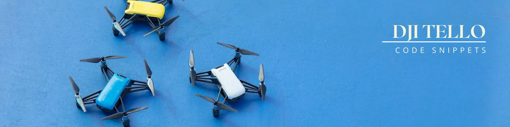

<h1 align="center">
  <a href="#"> DJI Tello: Code snippets </a>
</h1>


A small collection of Python examples for controlling a DJI Tello drone. These files are intended for demonstrations and classroom exercises.

## Contents
- `basic.py` – Demonstrates basic flight commands such as take-off, movement, rotation, and landing.
- `video.py` – Opens the Tello video stream, displays the camera image, and shows the battery level. Press `Q` to land and stop the program.
- `flip.py` – Performs forward, backward, left, and right flips after checking the battery level.
- `colorDetection.py` – Uses OpenCV to detect a line in the camera image and adjusts the drone's yaw to follow it.

## Requirements
- Python 3
- A DJI Tello or Tello EDU drone
- A computer with Wi-Fi
- The following Python packages:
  - `djitellopy`
  - `opencv-python` for `video.py` and `colorDetection.py`

The `time` module is part of Python and does not need to be installed separately.

## Installation
It is recommended to use a virtual environment:

```bash
python -m venv .venv
```

## Running an Example
1. Turn on the Tello drone.
2. Connect your computer to the Wi-Fi network created by the drone.
3. Activate the virtual environment, if you created one.
4. Run one of the examples:

```bash
python basic.py
python video.py
python flip.py
python colorDetection.py
```